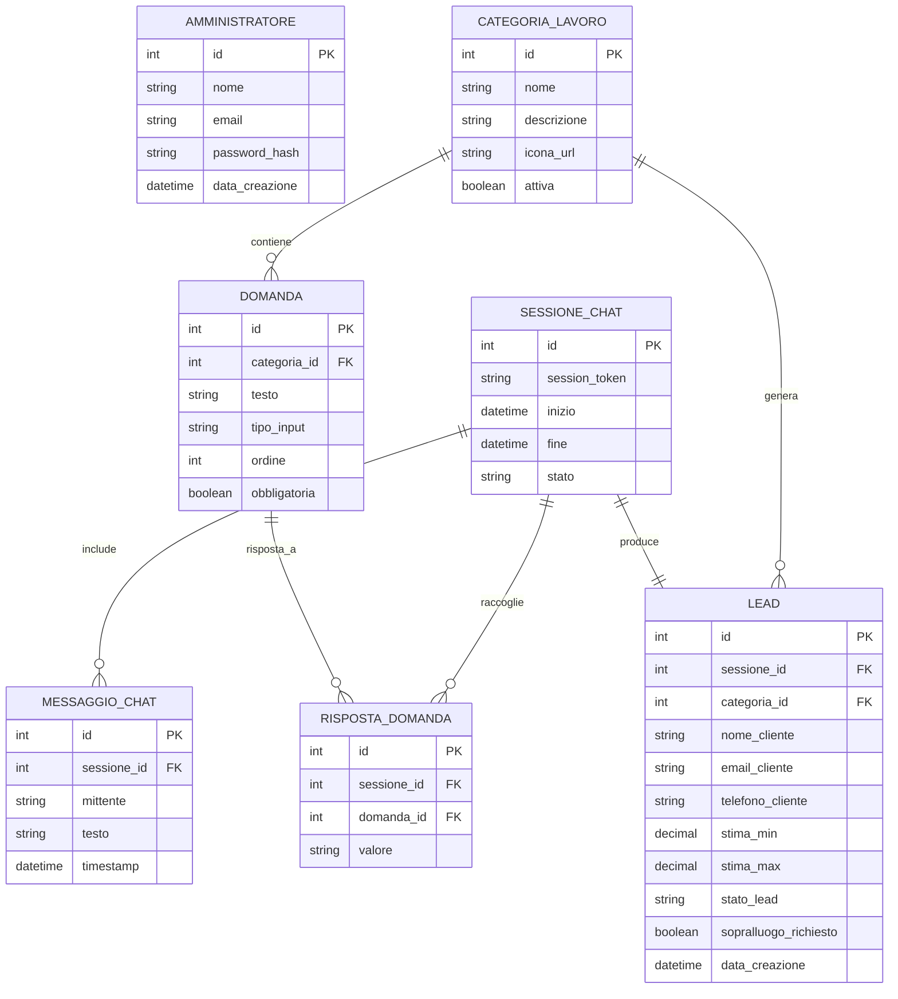

# SmartPreventivo

> Progetto di fine anno – Classe 5ª ITIS · Anno scolastico 2025/2026  
> Materie coinvolte: **Informatica · Sistemi e Reti · TPSIT · GPOI**

---

## Di cosa si tratta

**SmartPreventivo** è una piattaforma web che permette a potenziali clienti di un'azienda edile o impiantistica di ricevere un **preventivo indicativo** direttamente dal sito, senza dover chiamare o aspettare una risposta via email.

Il funzionamento è semplice: l'utente apre il widget chatbot nella pagina, seleziona il tipo di lavoro che vuole fare, risponde a qualche domanda guidata (tipo metratura, tipo impianto, ecc.) e alla fine riceve una **stima di costo min–max** calcolata automaticamente dal sistema. I dati vengono salvati come **lead** nel database e l'azienda viene notificata via email.

L'idea nasce da un problema reale: molte piccole aziende perdono tempo a rispondere a richieste generiche al telefono prima ancora di sapere se il cliente è davvero interessato. SmartPreventivo automatizza questo primo filtro.

---

## Funzionalità principali

- **Chatbot conversazionale** — guida l'utente passo dopo passo senza registrazione
- **6 categorie di lavoro supportate:** Fotovoltaico, Caldaie, Climatizzatori, Ristrutturazioni, Infissi, Impianti Elettrici
- **Calcolo automatico della stima** — range min/max basato sulle risposte dell'utente
- **Raccolta dati di contatto** — nome, telefono e email salvati come lead nel database
- **Notifica email automatica** — all'utente (riepilogo stima) e all'azienda (nuovo lead ricevuto)
- **Richiesta sopralluogo** — l'utente può richiedere un sopralluogo direttamente dalla chat con un click
- **Pannello amministrativo** — area riservata con login, visualizzazione lead, filtri per categoria/data ed esportazione CSV

---

## Stack tecnologico

| Layer | Tecnologia |
|---|---|
| **Backend** | Python 3 + Flask (Blueprint + Repository Pattern) |
| **Database** | SQLite (sviluppo) / PostgreSQL (produzione) |
| **Frontend** | HTML5, CSS3, JavaScript Vanilla (Fetch API) |
| **Autenticazione** | Flask-Login + bcrypt (Werkzeug) |
| **Email** | Flask-Mail + SMTP Gmail |
| **Deploy** | PythonAnywhere / server Linux con HTTPS |
| **Versionamento** | Git + GitHub |

---

## Struttura del progetto

```
smartpreventivo/
│
├── app/
│   ├── __init__.py          # App factory Flask
│   ├── models.py            # Modelli SQLAlchemy (Lead, Sessione, ecc.)
│   ├── blueprints/
│   │   ├── chat/            # Blueprint chatbot (API REST)
│   │   ├── admin/           # Blueprint pannello amministrativo
│   │   └── auth/            # Blueprint autenticazione
│   ├── repositories/
│   │   ├── lead_repository.py
│   │   ├── sessione_repository.py
│   │   └── categoria_repository.py
│   ├── services/
│   │   ├── calcolo_stima.py # Motore calcolo preventivi
│   │   └── email_service.py # Invio email SMTP
│   └── templates/           # HTML Jinja2
│       ├── chat/
│       └── admin/
│
├── static/
│   ├── css/
│   ├── js/
│   └── img/
│
├── data/
│   └── categorie.json       # Configurazione categorie, domande e prezzi
│
├── config.py
├── requirements.txt
├── run.py
└── README.md
```

---

## Database – Modello ER

Il database è composto da 7 tabelle. `SESSIONE_CHAT` è il fulcro del sistema: ogni sessione produce un `LEAD`, raccoglie le `RISPOSTA_DOMANDA` e include tutti i `MESSAGGIO_CHAT` scambiati. Le categorie e le domande sono configurabili senza toccare il codice.



---

## Come funziona (flusso utente)

```
Utente apre il sito
        │
        ▼
   Clicca sul widget chatbot
        │
        ▼
   Seleziona la categoria (es. Fotovoltaico)
        │
        ▼
   Risponde alle domande guidate (kW, tipo tetto, ecc.)
        │
        ▼
   Inserisce nome, telefono, email
        │
        ▼
   Il backend calcola la stima min–max
        │
        ▼
   Visualizza riepilogo + stima
        │
        ├──► Lead salvato nel DB
        ├──► Email inviata all'utente e all'azienda
        │
        ▼
   [Opzionale] Clicca "Richiedi Sopralluogo"
        │
        ▼
   Lead qualificato → contatto commerciale avviato
```

---

## Installazione e avvio in locale

### Prerequisiti
- Python 3.10 o superiore
- `pip` e `virtualenv`
- Account Gmail con password per le app abilitata (per l'invio email)

### Passaggi

```bash
# 1. Clona il repository
git clone https://github.com/MarcoClementi/Progetto_Fine_Anno25-26.git
cd Progetto_Fine_Anno25-26/smartpreventivo

# 2. Crea e attiva il virtual environment
python -m venv .venv

# Windows
.venv\Scripts\activate

# Linux / macOS
source .venv/bin/activate

# 3. Installa le dipendenze
pip install -r requirements.txt

# 4. Configura le variabili d'ambiente
cp .env.example .env
# Modifica .env con le tue credenziali SMTP e la secret key

# 5. Inizializza il database
flask db init
flask db migrate
flask db upgrade

# 6. (Opzionale) Crea un amministratore di default
flask create-admin

# 7. Avvia il server
flask run
```

L'applicazione sarà disponibile su `http://127.0.0.1:5000`

---

## Variabili d'ambiente (.env)

```env
SECRET_KEY=una_chiave_segreta_lunga_e_casuale
DATABASE_URL=sqlite:///smartpreventivo.db

MAIL_SERVER=smtp.gmail.com
MAIL_PORT=587
MAIL_USE_TLS=True
MAIL_USERNAME=tua_email@gmail.com
MAIL_PASSWORD=password_app_gmail
MAIL_DEFAULT_SENDER=tua_email@gmail.com

ADMIN_EMAIL=admin@esempio.it
```

> Non caricare mai il file `.env` su GitHub. E' gia' incluso nel `.gitignore`.

---

## Architettura – collegamento alle materie

### Informatica
Il backend è sviluppato con **Flask** seguendo il **Repository Pattern**: la logica di accesso al database è separata dalla logica applicativa. Le route sono organizzate in **Blueprint** (`/chat`, `/admin`, `/auth`) per tenere il codice ordinato e modulare.

### Sistemi e Reti
Il progetto segue un'architettura **client-server** classica su protocollo **HTTP/HTTPS**. Il frontend invia richieste REST al backend tramite `fetch()`. In produzione il deploy avviene su un server **Linux** con certificato SSL (Let's Encrypt).

### TPSIT
L'interfaccia è **mobile-first** e funziona da 320px in su. La comunicazione tra il chatbot e il server è **asincrona**: ogni messaggio viene inviato e ricevuto tramite **Fetch API** senza ricaricare la pagina, aggiornando solo il DOM della chat.

### GPOI
Il progetto è stato pianificato con un **Gantt** su 5 settimane e una stima dei costi per lo sviluppo dell'MVP (circa 4.400–6.600 EUR a tariffa di mercato). Sono stati definiti requisiti funzionali, non funzionali e di business, con analisi degli stakeholder.

---

## Requisiti non funzionali rispettati

- Interfaccia **mobile-first** (funziona da 320px)
- Risposta del bot entro **1 secondo** in condizioni normali
- Password admin salvate con **hash bcrypt**
- Comunicazioni via **HTTPS** in produzione
- Input sanitizzati contro **SQL Injection e XSS**
- Categorie e domande configurabili da **file JSON** senza toccare il codice
- Progetto eseguibile con **virtual environment Python**

---

## Pannello Amministrativo

Accessibile su `/admin` con credenziali protette. Permette di:

- Visualizzare tutti i lead ricevuti
- Filtrare per **categoria** e **data**
- Vedere i dettagli di ogni lead (risposte date, stima, contatti)
- Esportare i lead in **CSV**

---

## Documentazione

Nella root del repository e' disponibile il documento dei requisiti completo:

- `SmartPreventivo – Documento dei Requisiti (V3).md` — analisi con casi d'uso, diagrammi ER e UML, pianificazione Gantt e stima costi

---

## Autore

**Marco Clementi** — Classe 5M · A.S. 2025/2026

---

## Licenza

Distribuito sotto licenza **MIT**. Vedi il file `LICENSE` per i dettagli.

---

*"The last dance 😢"*
