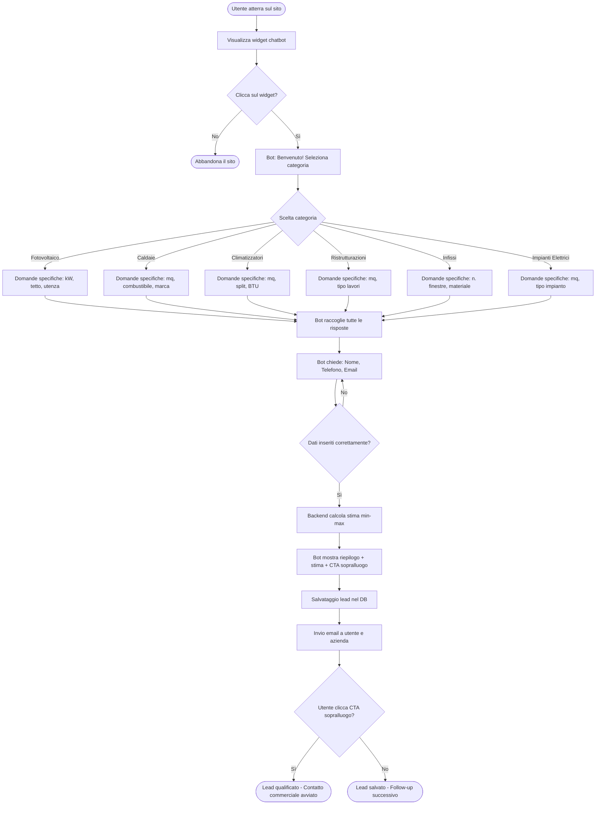
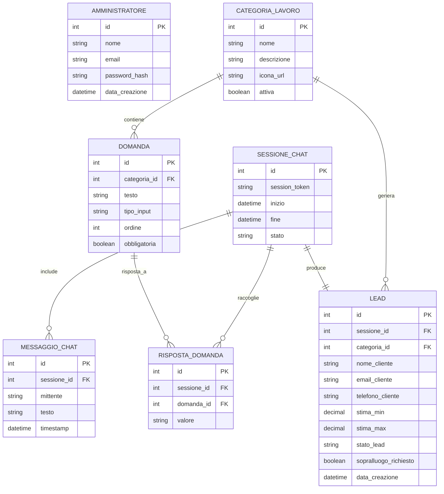
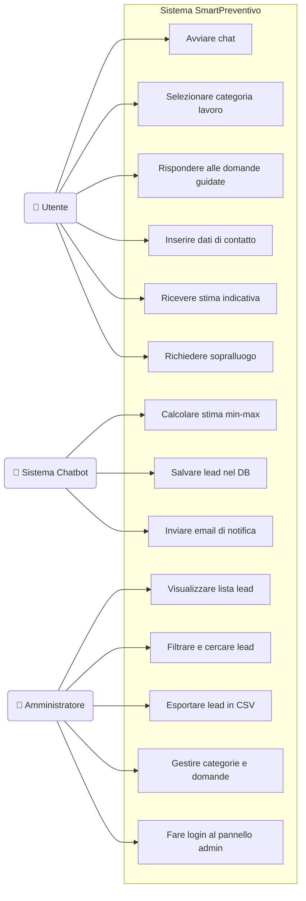
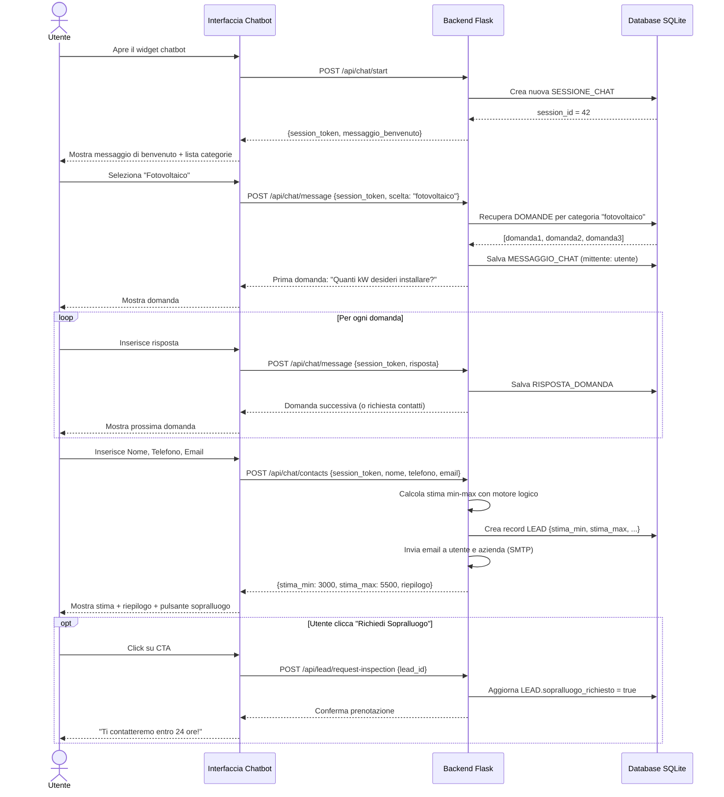
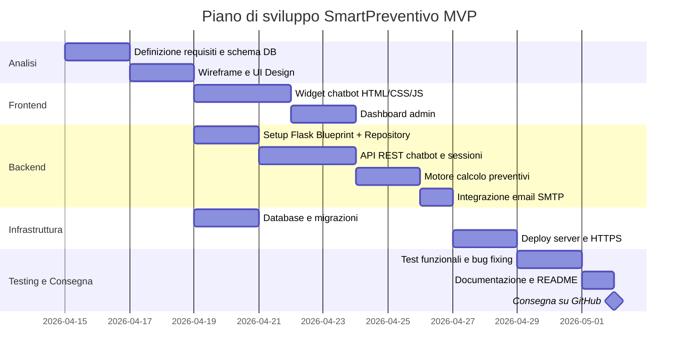

# SmartPreventivo – Documentazione Tecnica del Progetto

> **Progetto per il corso di Informatica – Classe 5ª**
> Documento redatto seguendo il modello del Documento dei Requisiti adottato in classe.
> Collegamento interdisciplinare: Informatica · Sistemi e Reti · TPSIT · GPOI

---

## Indice

1. Introduzione e Contesto
2. PRD – Documento dei Requisiti
3. Diagramma di Flusso (User Flow)
4. Modello ER (Entity-Relationship)
5. Diagrammi UML
6. Stima Costi e Tempi di Sviluppo

---

## 1. Introduzione e Contesto

### 1.1 Visione del Prodotto

**SmartPreventivo** è una piattaforma web che automatizza la fase iniziale di acquisizione clienti nel settore edilizio e impiantistico tramite un chatbot conversazionale. L'obiettivo è permettere all'utente di ricevere una stima di costo indicativa (range min-max) senza attendere l'intervento di un operatore umano.

### 1.2 Problema che risolve

Le aziende di settore ricevono molte richieste di preventivo via telefono o email. La maggior parte di queste richieste richiede un primo contatto per raccogliere informazioni base (tipo di lavoro, metratura, ecc.) prima che un tecnico possa intervenire. SmartPreventivo automatizza questo primo filtro, risparmiando tempo all'azienda e fornendo una risposta immediata al cliente.

### 1.3 Collegamento alle materie

| Materia | Contributo al progetto |
|---|---|
| **Informatica** | Backend Python/Flask, logica del chatbot, API REST |
| **Sistemi e Reti** | Architettura client-server, protocollo HTTP/HTTPS, deploy su server |
| **TPSIT** | Progettazione dell'interfaccia web, comunicazione asincrona (AJAX/Fetch API) |
| **GPOI** | Pianificazione del progetto, gestione del team, analisi costi/tempi |

### 1.4 Categorie di Lavoro Supportate

- Fotovoltaico
- Caldaie e impianti termici
- Climatizzatori
- Ristrutturazioni edili
- Infissi (porte e finestre)
- Impianti Elettrici

---

## 2. PRD – Documento dei Requisiti

### 2.1 Requisiti Funzionali (RF)

Cosa il sistema **deve fare**:

**RF-01 – Avvio sessione chatbot**
L'utente deve poter avviare una conversazione con il bot cliccando su un widget nella pagina web, senza necessità di registrazione.

**RF-02 – Selezione categoria lavoro**
Il bot deve presentare una lista di categorie di lavoro tra cui l'utente può scegliere (fotovoltaico, caldaie, climatizzatori, ristrutturazioni, infissi, impianti elettrici).

**RF-03 – Domande guidate**
Per ogni categoria, il bot deve porre una serie di domande specifiche (es. metratura, tipo di abitazione, marca preferita) per raccogliere i dati necessari al calcolo.

**RF-04 – Calcolo stima costo**
Il backend deve elaborare le risposte e restituire una stima indicativa con un range minimo e massimo (es. "tra 3.000€ e 5.500€").

**RF-05 – Raccolta dati di contatto**
Prima di mostrare la stima, il bot deve richiedere nome, numero di telefono e indirizzo email dell'utente.

**RF-06 – Riepilogo e Call To Action**
Al termine, il bot mostra un riepilogo della richiesta, la stima calcolata e un pulsante per richiedere un sopralluogo.

**RF-07 – Salvataggio lead**
I dati dell'utente e della richiesta devono essere salvati nel database come "lead".

**RF-08 – Notifica email**
Il sistema deve inviare automaticamente una email all'azienda con i dati del lead e all'utente con il riepilogo della stima.

**RF-09 – Pannello amministrativo**
L'amministratore (l'azienda) deve poter accedere a un'area riservata per visualizzare, filtrare ed esportare i lead ricevuti.

**RF-10 – Gestione sessione**
La sessione della chat deve essere mantenuta lato server per tutta la durata della conversazione.

---

### 2.2 Requisiti Non Funzionali (RNF)

Vincoli su **come** il sistema deve operare:

**RNF-01 – Performance**
Il bot deve rispondere a ogni messaggio entro 1 secondo in condizioni normali di carico.

**RNF-02 – Responsive / Mobile-first**
L'interfaccia del chatbot deve funzionare correttamente su dispositivi mobili (smartphone, tablet). Il layout deve adattarsi a schermi da 320px in su.

**RNF-03 – Sicurezza**
Le credenziali dell'amministratore devono essere salvate con hashing sicuro (bcrypt). Tutte le comunicazioni devono avvenire tramite HTTPS. Gli input dell'utente devono essere sanitizzati per prevenire SQL Injection e XSS.

**RNF-04 – Disponibilità**
Il sistema deve essere disponibile almeno il 99% del tempo (circa 7 ore di downtime al mese accettabili per un MVP).

**RNF-05 – Scalabilità**
L'architettura deve consentire di aggiungere nuove categorie di lavoro e nuove domande senza modificare il codice core, ma solo aggiornando i dati di configurazione (file JSON o tabella DB).

**RNF-06 – Manutenibilità**
Il codice deve seguire il Repository Pattern e la struttura a Blueprint (come studiato in classe) per separare le responsabilità.

---

### 2.3 Requisiti di Business (RB)

Metriche di successo del prodotto:

**RB-01 – Tasso di completamento della chat**
Almeno il 60% degli utenti che avviano la chat devono completarla fino all'inserimento dei contatti.

**RB-02 – Qualità dei lead**
Almeno il 40% dei lead generati deve trasformarsi in una richiesta di sopralluogo entro 30 giorni.

**RB-03 – Riduzione del carico operativo**
Il sistema deve ridurre del 50% il numero di telefonate iniziali di qualificazione ricevute dall'azienda.

**RB-04 – Tempo medio di risposta**
L'azienda deve ricevere la notifica email del lead entro 2 minuti dal completamento della chat.

---

## 3. Diagramma di Flusso (User Flow)

Il seguente diagramma mostra il percorso completo dell'utente dall'apertura del sito fino alla generazione del lead.

---

## 4. Modello ER (Entity-Relationship)

Il database relazionale del progetto è composto dalle seguenti entità principali.

---

## 5. Diagrammi UML

### 5.1 Use Case Diagram

Gli attori del sistema sono tre: l'Utente (non registrato), il Sistema Chatbot e l'Amministratore (l'azienda).

---

### 5.2 Sequence Diagram

Il diagramma di sequenza mostra l'interazione temporale tra i componenti durante una singola sessione di richiesta preventivo.

---

## 6. Stima Costi e Tempi di Sviluppo (MVP)

La stima si riferisce allo sviluppo del Minimum Viable Product, ovvero la versione funzionante con le funzionalità essenziali (almeno Livello 1 e 2 dei criteri di valutazione).

### 6.1 Tabella riepilogativa

| Fase | Descrizione attività | Giorni stimati | Costo indicativo |
|---|---|---|---|
| **1. Analisi e UI/UX Design** | Definizione requisiti, wireframe del chatbot, design mockup pagine, definizione schema DB | 3 gg | 600 – 900 € |
| **2. Sviluppo Frontend** | HTML/CSS/JS del widget chatbot, interfaccia responsive mobile-first, pagina admin dashboard | 5 gg | 1.000 – 1.500 € |
| **3. Sviluppo Backend** | Flask app factory + Blueprint, Repository Pattern, motore di calcolo preventivi, API REST, invio email SMTP, gestione sessioni | 8 gg | 1.600 – 2.400 € |
| **4. Setup Infrastruttura e DB** | Configurazione SQLite (sviluppo) / PostgreSQL (produzione), script di migrazione, setup server (es. PythonAnywhere o VPS), HTTPS con Let's Encrypt | 3 gg | 600 – 900 € |
| **5. Testing e Rilascio** | Test funzionali, correzione bug, test su dispositivi mobili, documentazione finale, deploy | 3 gg | 600 – 900 € |
| **TOTALE MVP** | | **22 giorni** | **4.400 – 6.600 €** |

> Nota: il costo è calcolato su una tariffa giornaliera di 200–300 € per uno sviluppatore junior/mid. Per un progetto scolastico il costo reale è 0, ma questa stima è utile per la materia GPOI e per capire il valore di mercato del prodotto.

---

### 6.2 Gantt – Piano di Sviluppo

---

### 6.3 Stack Tecnologico Consigliato

| Layer | Tecnologia | Motivazione |
|---|---|---|
| **Frontend** | HTML5, CSS3, JavaScript (Vanilla o Bootstrap) | Studiato in classe, leggero, nessuna dipendenza |
| **Backend** | Python 3.x + Flask | Come da traccia 5ª, Repository Pattern + Blueprint |
| **Database** | SQLite (sviluppo) / PostgreSQL (produzione) | SQLite per semplicità locale, PostgreSQL per deploy reale |
| **Email** | Flask-Mail + SMTP Gmail | Semplice, gratuito per volumi bassi |
| **Autenticazione** | Flask-Login + Werkzeug (bcrypt) | Standard di sicurezza studiato in classe |
| **Deploy** | PythonAnywhere (gratuito per MVP) | Facile da usare, perfetto per progetti Flask scolastici |
| **Versionamento** | GitHub | Consegna obbligatoria come da istruzioni del docente |

---

## 7. Glossario

| Termine | Definizione |
|---|---|
| **Lead** | Utente che ha completato la chat e lasciato i propri dati di contatto |
| **MVP** | Minimum Viable Product – versione minima funzionante del prodotto |
| **CTA** | Call To Action – pulsante o azione che invita l'utente a compiere il passo successivo |
| **Stima min-max** | Range di costo indicativo calcolato in base alle risposte fornite |
| **Blueprint** | Modulo Flask per organizzare le route in gruppi separati |
| **Repository Pattern** | Architettura che separa la logica di accesso al database dal resto del codice |
| **Session Token** | Identificatore univoco della sessione di chat, generato dal server |
| **SMTP** | Simple Mail Transfer Protocol – protocollo per l'invio di email |

---

*Documento redatto per il progetto SmartPreventivo – Corso di Informatica Classe 5ª*
*Collegamento interdisciplinare: Sistemi e Reti | TPSIT | GPOI*