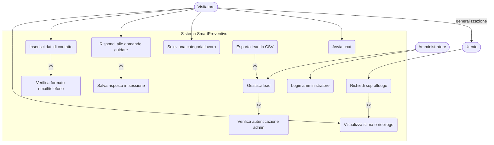
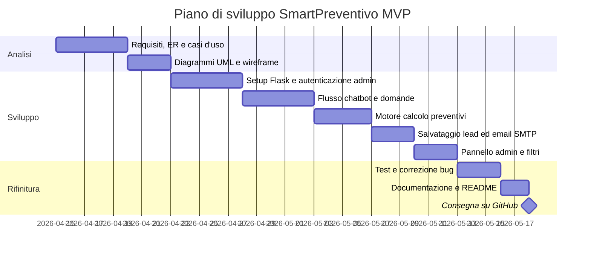

# SmartPreventivo – Documento dei Requisiti

> Progetto per il corso di **Informatica – Classe 5ª**
> Struttura seguita: modello `5m_Esempio_Documento_Requisiti.md`
> Collegamento interdisciplinare: **Informatica · Sistemi e Reti · TPSIT · GPOI**

---

## 1. Introduzione

### 1.1 Scopo del documento

Lo scopo di questo documento è:
- descrivere in modo chiaro il prodotto da realizzare: **SmartPreventivo**;
- raccogliere i requisiti funzionali e non funzionali;
- fornire una prima progettazione concettuale con diagrammi e casi d'uso;
- definire una roadmap di lavoro con milestone e attività principali.

### 1.2 Contesto

Il progetto rientra nel modulo `03_Sviluppo_Web_e_Database` del quinto anno. Prevede:
- una gestione dati persistente (sessioni, lead, domande);
- una parte di autenticazione e sicurezza (pannello admin);
- un'interfaccia web con interazione dinamica (chatbot);
- relazioni tra più tabelle nel database (lead, sessioni, categorie, risposte).

### 1.3 Tema d'esempio

Tema scelto per il progetto: **SmartPreventivo**.

SmartPreventivo è una piattaforma web che automatizza la fase iniziale di acquisizione clienti nel settore edilizio e impiantistico tramite un chatbot conversazionale. L'utente risponde a domande guidate e riceve una stima di costo indicativa (range min–max) senza attendere un operatore umano. I dati vengono salvati come "lead" e notificati all'azienda tramite email.

Il collegamento alle materie di indirizzo è il seguente:

| Materia | Contributo al progetto |
|---|---|
| **Informatica** | Backend Python/Flask, logica del chatbot, API REST, Repository Pattern |
| **Sistemi e Reti** | Architettura client-server, protocollo HTTP/HTTPS, deploy su server Linux |
| **TPSIT** | Interfaccia web mobile-first, comunicazione asincrona con Fetch API / AJAX |
| **GPOI** | Pianificazione del progetto, stima costi e tempi, analisi stakeholder |

---

## 2. Obiettivi generali

- Permettere a qualsiasi visitatore di avviare una chat senza registrazione.
- Guidare l'utente nella selezione della categoria di lavoro e raccogliere i dati necessari al calcolo.
- Calcolare automaticamente una stima di costo (min–max) in base alle risposte fornite.
- Raccogliere i dati di contatto dell'utente e salvarli come lead nel database.
- Notificare l'azienda via email di ogni nuovo lead ricevuto.
- Permettere all'amministratore di accedere a un pannello riservato per gestire i lead.

**Categorie di lavoro supportate:** Fotovoltaico · Caldaie · Climatizzatori · Ristrutturazioni · Infissi · Impianti Elettrici

---

## 3. Stakeholder e attori

| Stakeholder | Ruolo | Interesse |
|---|---|---|
| Studente | Sviluppatore | Realizzare il progetto rispettando i requisiti |
| Docente | Valutatore | Verificare correttezza tecnica e completezza |
| Azienda edile/impiantistica | Committente / Admin | Ricevere lead qualificati senza intervento manuale |
| Utente finale | Cliente potenziale | Ottenere una stima rapida del costo del lavoro |

### Attori principali

- `Visitatore` – utente non autenticato che interagisce con il chatbot; può avviare la chat, scegliere la categoria, rispondere alle domande e inserire i propri contatti.
- `Utente` – specializzazione del Visitatore: può fare tutto ciò che fa un Visitatore, più richiedere il sopralluogo dopo aver ricevuto la stima. Non va confuso con un utente registrato: la distinzione è solo concettuale, in senso UML.
- `Amministratore` – rappresenta l'azienda; accede all'area riservata tramite login per visualizzare, filtrare ed esportare i lead ricevuti.

---

## 4. Requisiti funzionali

### 4.1 Requisiti principali

1. Avvio della chat tramite widget nella pagina, senza registrazione.
2. Selezione della categoria di lavoro tra quelle disponibili.
3. Risposte a domande guidate specifiche per categoria (metratura, tipo impianto, ecc.).
4. Inserimento di nome, telefono ed email prima di visualizzare la stima.
5. Calcolo automatico della stima di costo (range min–max) basata sulle risposte.
6. Visualizzazione del riepilogo e della stima con pulsante per richiedere il sopralluogo.
7. Salvataggio del lead nel database con tutti i dati della sessione.
8. Invio automatico di email all'utente (riepilogo stima) e all'azienda (notifica lead).
9. Login protetto per l'amministratore.
10. Pannello admin per visualizzare, filtrare ed esportare i lead.

### 4.2 User stories

- Come **visitatore**, voglio avviare la chat con un click per ricevere subito un'idea del costo del lavoro.
- Come **visitatore**, voglio selezionare la categoria di lavoro in modo da ricevere domande pertinenti alla mia situazione.
- Come **utente**, voglio inserire i miei contatti e ricevere la stima via email per poterla rileggere con calma.
- Come **utente**, voglio richiedere un sopralluogo direttamente dalla chat per non dover cercare altri contatti.
- Come **amministratore**, voglio vedere tutti i lead ricevuti con i relativi dati per poter fare follow-up commerciale.
- Come **amministratore**, voglio filtrare i lead per categoria e data per organizzare il lavoro del team.

---

## 5. Requisiti non funzionali

- L'interfaccia del chatbot deve essere **mobile-first** e funzionare su schermi da 320px in su.
- Il bot deve rispondere a ogni messaggio entro **1 secondo** in condizioni normali di carico.
- Le credenziali dell'amministratore devono essere salvate con **hashing bcrypt**.
- Tutte le comunicazioni devono avvenire tramite **HTTPS**.
- Gli input dell'utente devono essere **sanitizzati** per prevenire SQL Injection e XSS.
- Il backend deve essere organizzato con **Blueprint e Repository Pattern** come da standard di classe.
- Le categorie e le domande devono essere configurabili tramite file JSON o tabella DB, **senza modificare il codice core**.
- Il progetto deve essere eseguibile localmente con **ambiente virtuale Python** (`.venv`).
- I dati devono essere **persistenti** tra una sessione e l'altra.

---

## 6. Casi d'uso

### 6.1 Casi d'uso essenziali

1. `Avvia chat`
2. `Seleziona categoria lavoro`
3. `Rispondi alle domande guidate`
4. `Inserisci dati di contatto`
5. `Visualizza stima e riepilogo`
6. `Richiedi sopralluogo`
7. `Login amministratore`
8. `Gestisci lead`

### 6.2 Descrizione semplificata dei casi d'uso

- **Avvia chat**: il visitatore clicca sul widget chatbot; il sistema crea una nuova sessione e mostra il messaggio di benvenuto.
- **Seleziona categoria lavoro**: il bot presenta le categorie disponibili; il visitatore ne sceglie una tra le sei supportate.
- **Rispondi alle domande guidate**: per la categoria selezionata il bot pone una serie di domande specifiche; l'utente risponde una alla volta; le risposte vengono salvate nella sessione.
- **Inserisci dati di contatto**: il bot chiede nome, telefono ed email; i dati vengono validati prima di procedere al calcolo.
- **Visualizza stima e riepilogo**: il backend calcola la stima min–max; il bot mostra il riepilogo completo con la stima indicativa.
- **Richiedi sopralluogo**: l'utente (che ha già fornito i contatti) clicca sul pulsante CTA; il sistema aggiorna il lead come "sopralluogo richiesto".
- **Login amministratore**: l'amministratore inserisce email e password; il sistema verifica le credenziali con hash bcrypt e apre la sessione admin.
- **Gestisci lead**: l'amministratore autenticato visualizza, filtra, esamina ed esporta i lead ricevuti.

### 6.3 Relazioni tra casi d'uso: include ed extend

In un diagramma dei casi d'uso si usano due tipi di relazioni aggiuntive:

- `<<include>>`: rappresenta un comportamento **obbligatorio** riutilizzabile. Un caso d'uso base include un altro quando quel comportamento è **sempre** eseguito.
- `<<extend>>`: rappresenta un comportamento **opzionale o condizionale** che si aggiunge al caso d'uso base solo in certe condizioni.

I casi d'uso non devono essere confusi con i rapporti tra attori. Nel nostro progetto, `Utente` è un attore specializzato di `Visitatore`: può fare tutto ciò che fa un Visitatore, più alcune azioni aggiuntive. Questo si modella con una **generalizzazione tra attori**, non con `include` o `extend`.

**Relazioni `<<include>>` nel progetto:**

- `Inserisci dati di contatto` <<include>> `Verifica formato email/telefono` – la validazione è sempre obbligatoria prima di salvare i contatti.
- `Gestisci lead` <<include>> `Verifica autenticazione admin` – il pannello è sempre protetto da login.
- `Rispondi alle domande guidate` <<include>> `Salva risposta in sessione` – ogni risposta viene sempre registrata nella sessione attiva.

**Relazioni `<<extend>>` nel progetto:**

- `Richiedi sopralluogo` <<extend>> `Visualizza stima e riepilogo` – richiedere il sopralluogo è un'azione opzionale disponibile solo dopo aver visto la stima.
- `Esporta lead in CSV` <<extend>> `Gestisci lead` – l'esportazione è una funzione aggiuntiva, non sempre usata dall'amministratore.

### 6.4 Diagramma dei casi d'uso

---

## 7. Glossario dei termini

- `Lead`: utente che ha completato la chat e lasciato i propri dati di contatto.
- `Sessione chat`: sequenza di messaggi scambiati tra utente e bot in una singola visita.
- `Stima min–max`: range di costo indicativo calcolato in base alle risposte fornite.
- `CTA`: Call To Action – pulsante che invita l'utente a compiere il passo successivo.
- `Amministratore`: rappresentante dell'azienda con accesso al pannello di gestione lead.
- `Blueprint`: modulo Flask per organizzare le route in gruppi separati.
- `Repository Pattern`: architettura che separa la logica di accesso al database dal resto del codice.
- `Session Token`: identificatore univoco della sessione di chat, generato dal server.
- `SMTP`: Simple Mail Transfer Protocol – protocollo standard per l'invio di email.
- `MVP`: Minimum Viable Product – versione minima funzionante del prodotto.

---

## 8. Pianificazione e milestone

Le tre fasi principali del progetto sono:

- **Analisi**: definire i requisiti, i casi d'uso e i modelli concettuali (ER e UML).
- **Sviluppo**: realizzare le funzionalità, l'interfaccia e la gestione dati.
- **Rifinitura**: testare, correggere e preparare la consegna.

Piano di lavoro su 5 settimane:

| Settimana | Attività |
|---|---|
| 1 | Analisi requisiti, schema ER, diagrammi UML e casi d'uso, preparazione ambiente |
| 2 | Setup Flask + Blueprint, sistema di autenticazione admin, gestione sessioni chat |
| 3 | Flusso chatbot completo (domande per categoria), motore di calcolo preventivi |
| 4 | Salvataggio lead, invio email SMTP, pannello admin con filtri |
| 5 | Testing, correzioni bug, documentazione README, consegna su GitHub |

### 8.1 Gantt semplificato

> Il Gantt è utile per la materia GPOI, ma in classe può bastare anche la tabella delle milestone.

---

*Documento redatto per il progetto SmartPreventivo – Corso di Informatica Classe 5ª*
*Riferimenti: `5m_Esempio_Documento_Requisiti.md` · `5m_diagrammi_casi_uso.md`*
